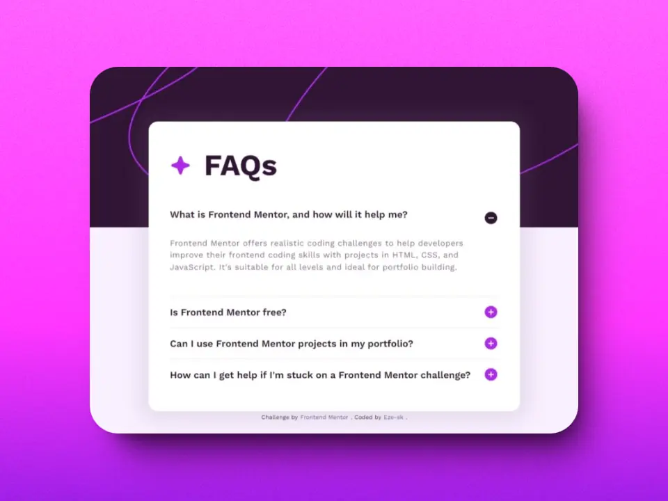

# Frontend Mentor - FAQ Accordion

<a href="/" target="_blank" rel="noopener noreferrer" title="Live Demo" style="display: block; font-weight: bold; text-transform: uppercase; text-decoration: underline; font-size: 1.3rem; margin: 1rem; margin-left: 25%;">
  Live Demo 
  <svg width="16" height="16" fill="currentColor">
  <path 
    fill-rule="evenodd" 
    d="M14 2.5a.5.5 0 0 0-.5-.5h-6a.5.5 0 0 0 0 1h4.793L2.146 13.146a.5.5 0 0 0 .708.708L13 3.707V8.5a.5.5 0 0 0 1 0z"/>
  </svg>
</a>

  
Table of Contents

  <ol>
    <li><a href="#the-challenge">The challenge</a></li>
    <li>
      <a href="#my-process">My process</a>
      <ul>
        <li><a href="#built-with">Built With</a></li>
        <li><a href="#what-i-learned">What I Learned</a></li>
        <li><a href="#continued-development">Continued Development</a></li>
      </ul>
    </li>
    <li><a href="#author">Author</a></li>
  </ol>

## The challenge

### The challenge should do:

- [x] Hide/Show the answer to a question when the question is clicked
- [x] Navigate the questions and hide/show answers using keyboard navigation alone
- [x] View the optimal layout for the interface depending on their device's screen size
- [x] See hover and focus states for all interactive elements on the page

## My process

### Built with

- HTML5 markup
- HTML5 semantics
- CSS custom properties
- CSS flexbox
- JavaScript

(<a href="#readme-top">back to top</a>)

### What I learned

In this challenge, I developed an <strong>FAQ accordion</strong> using HTML, CSS,
and JavaScript. I learned how to improve the accessibility of web pages by adding keyboard navigation and highlighting them using ` :hover` and `:focus`

### Continued development

Continue strengthening my JavaScript knowledge by solving <strong>Frontend Mentor</strong> challenges.

## Author

- Github: [Ezequiel-skl](https://github.com/Ezequiel-skl)
- Frontend Mentor - [@Ezequiel-skl](https://www.frontendmentor.io/profile/Ezequiel-skl)

(<a href="#readme-top">back to top</a>)

