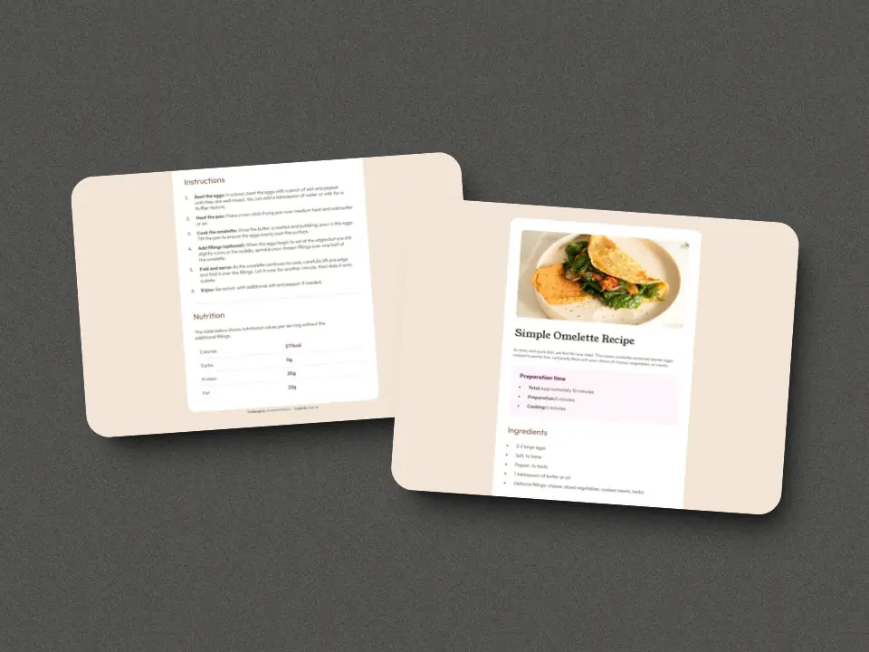

# Frontend Mentor - Recipe page

<a href="https://completed-frontend-mentor-challenges.vercel.app/recipe-page" target="_blank" rel="noopener noreferrer" title="Live Demo" style="display: block; font-weight: bold; text-transform: uppercase; text-decoration: underline; font-size: 1.3rem; margin: 1rem; margin-left: 25%;">
  Live Demo 
  <svg width="16" height="16" fill="currentColor">
  <path 
    fill-rule="evenodd" 
    d="M14 2.5a.5.5 0 0 0-.5-.5h-6a.5.5 0 0 0 0 1h4.793L2.146 13.146a.5.5 0 0 0 .708.708L13 3.707V8.5a.5.5 0 0 0 1 0z"/>
  </svg>
</a>

  
Table of Contents

  <ol>
    <li><a href="#the-challenge">The challenge</a></li>
    <li>
      <a href="#my-process">My process</a>
      <ul>
        <li><a href="#built-with">Built With</a></li>
        <li><a href="#what-i-learned">What I Learned</a></li>
        <li><a href="#continued-development">Continued Development</a></li>
      </ul>
    </li>
    <li><a href="#author">Author</a></li>
  </ol>

## The challenge

### The challenge should do:

- [x] Your challenge is to build out this recipe page and get it looking as close to the design as possible.

## My process

### Built with

- HTML5 markup
- HTML5 semantics
- CSS custom properties
- CSS flexbox

### What I learned

In this challenge, I developed my design and styling skills by creating a <strong>simple recipe page</strong> and improving my remponsive page skills.

### Continued development

Continue strengthening my knowledge in frontend by solving the challenges of <strong>Frontend Mentor</strong>.

## Author

- Github: [Ezequiel-skl](https://github.com/Ezequiel-skl)
- Frontend Mentor - [@Ezequiel-skl](https://www.frontendmentor.io/profile/Ezequiel-skl)

(<a href="#readme-top">back to top</a>)

