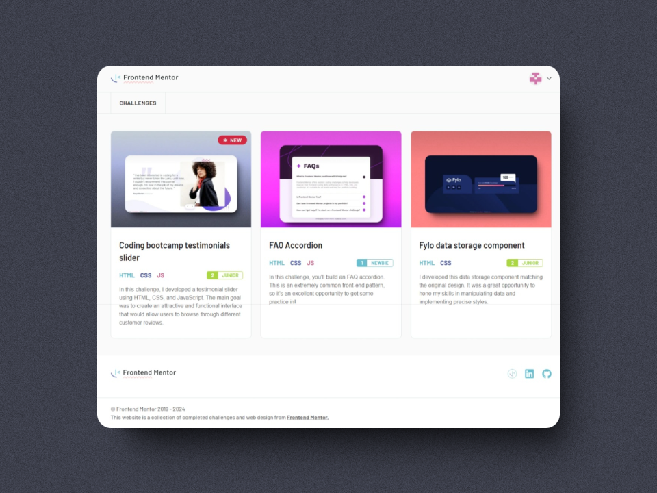

<a name="readme-top"></a>

# frontend mentor completed challenges website




<a href="https://completed-frontend-mentor-challenges.vercel.app" target="_blank" rel="noopener noreferrer" title="Live Demo" style="display: block; font-weight: bold; text-transform: uppercase; text-decoration: underline; font-size: 1.3rem; margin: 1rem; margin-left: 25%;">
  Live Demo 
  <svg width="16" height="16" fill="currentColor">
  <path 
    fill-rule="evenodd" 
    d="M14 2.5a.5.5 0 0 0-.5-.5h-6a.5.5 0 0 0 0 1h4.793L2.146 13.146a.5.5 0 0 0 .708.708L13 3.707V8.5a.5.5 0 0 0 1 0z"/>
  </svg>
</a>

## Getting Started

- To contribute to the website you need to have [Node.js +18](https://nodejs.org/) installed and [pnpm](https://pnpm.io/):

```bash
  npm i -g pnpm
```

1. Install the dependencies: 

```bash
  pnpm install
```

2. Start the development server:

```bash
  pnpm dev
```

3. Open the website in your browser at [http://localhost:4321](http://localhost:4321)

## Built with

- [**Astro**](https://astro.build/) - The web framework for content-driven websites.
- [**TypeScript**](https://www.typescriptlang.org/) - A typed superset of JavaScript that compiles to plain JavaScript.
- [**Tailwind CSS**](https://tailwindcss.com/) - A utility-first CSS framework for rapidly building custom designs.

## Author

- Github: [Ezequiel-skl](https://github.com/Ezequiel-skl)
- Frontend Mentor - [@Ezequiel-skl](https://www.frontendmentor.io/profile/Ezequiel-skl)

<p align="right">(<a href="#readme-top">back to top</a>)</p>
